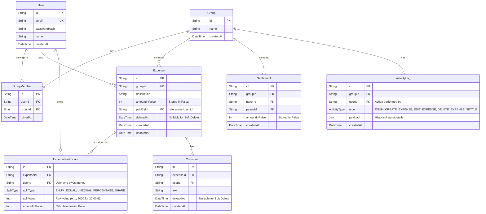

# Build Plan: Splitwise Clone MVP

This document outlines the architecture, database schema, API specification, and deployment plan.

## 1. Database ERD (PostgreSQL via Prisma)



## 2. API Specification (Next.js App Router)

### Authentication (NextAuth.js)
- `POST /api/auth/...`: Handled by NextAuth.

### Dashboard
- `GET /api/dashboard`: Aggregated balance summaries across all groups (derived via `balanceEngine.ts`).

### Groups
- `POST /api/groups`: Create group
- `GET /api/groups`: List user's groups
- `GET /api/groups/:id`: Get group details, members, and net balances (derived via `balanceEngine.ts`)
- `POST /api/groups/:id/members`: Add user to group
- `DELETE /api/groups/:id/members/:userId`: Remove user (validates zero balance)

### Expenses
- `POST /api/groups/:id/expenses`: Add an expense (supports Equal, Unequal, Percent, Share)
- `PUT /api/groups/:id/expenses/:expenseId`: Edit expense (creates activity log)
- `DELETE /api/groups/:id/expenses/:expenseId`: Soft delete expense (`deletedAt`)

### Settlements
- `POST /api/groups/:id/settlements`: Log a direct payment between two users.

### Feed & Comments
- `GET /api/groups/:id/feed`: Unified chronological feed of Expenses, Settlements, Comments, and Activity Logs.
- `POST /api/expenses/:expenseId/comments`: Add a comment (pushes real-time update via Pusher).

## 3. Folder Structure (Next.js Monorepo)

```text
/
├── prisma/
│   └── schema.prisma        # Database schema
├── src/
│   ├── app/                 # Next.js App Router pages & API routes
│   │   ├── dashboard/       # Main user dashboard
│   │   ├── group/[id]/      # Group details, ledger, and feed
│   │   └── api/             # Route handlers
│   ├── components/
│   │   ├── ui/              # shadcn/ui components
│   │   └── shared/          # Custom reusable components
│   ├── lib/
│   │   ├── db.ts            # Prisma client instantiation
│   │   ├── balanceEngine.ts # Centralized balance and debt logic
│   │   └── pusher.ts        # Pusher real-time configuration
│   └── store/               # Zustand state slices
├── ARCHITECTURE_NOTES.md
├── BUILD_PLAN.md
├── AI_CONTEXT.md
└── README.md
```

## 4. Deployment Plan
- **Frontend & API:** Vercel
- **Database:** Neon (Serverless Postgres)
- **Real-Time:** Pusher

## 5. Testing Plan
- **Unit Tests:** `lib/balanceEngine.ts` must have 100% coverage.
- **E2E Tests:** Playwright for Happy Path.

## 6. Implementation Progress
- [x] 1. Database Initialization & Schema
- [x] 2. Authentication (NextAuth + Credentials)
- [x] 3. Group CRUD
- [x] 4. Expense CRUD
- [x] 5. balanceEngine.ts with TDD
- [x] 6. Settlements
- [x] 7. Dashboard summaries
- [x] 8. Real-time comments (Mocked MVP)
- [x] 9. Activity feed
- [ ] 10. Testing
- [ ] 11. Deployment
